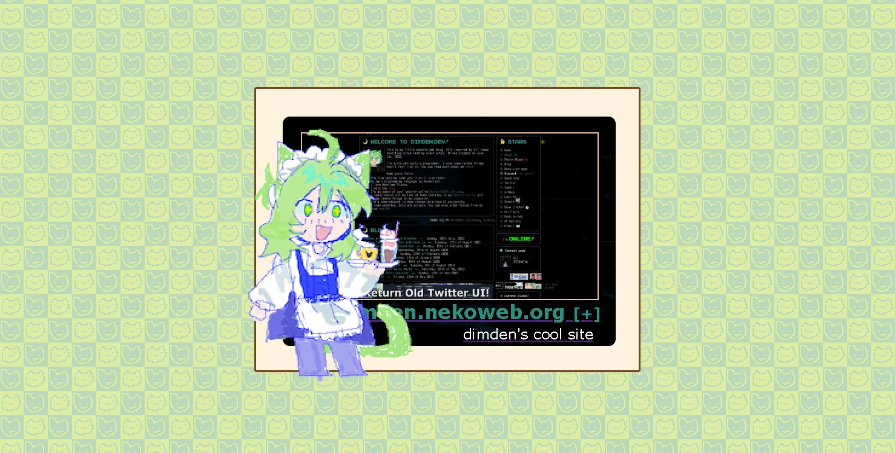

# remi's Sitebox Previewer for Nekoweb

A quickly hacked together tool for [nekoweb](https://nekoweb.org) users to preview siteboxes, designed to be ran by just opening index.html in your browser of choice.

Note that the preview may not be exactly accurate as to how the sitebox appears on the nekoweb website. This concerns both previewing other users' siteboxes and hacking on your own CSS, as not all selectors and properties are supported due to the way nekoweb handles `elements.css`. I personally have no idea what are the exact boundaries, but I stepped on enough rakes to know that.

## Usage

### Previewing siteboxes of nekoweb users

- Clone this repository or download the archive.
- Open the project in your code editor of choice,
- Set a desired nekoweb username in `bannerInfo.js`.
- Open `index.html` in browser to see a preview.

### Hacking on your own elements.css

- Uncomment line 9 in `index.html`.
- Place `elements.css` you wish to modify in your project folder.
- (Optional) Comment the function calls at the end of `bannerInfo.js` to not needlessly fetch stuff from nekoweb.

## Attribution

Code is licensed under the [MIT license](LICENSE.txt). Assets from Nekoweb belong to Nekoweb and are used with permission.
